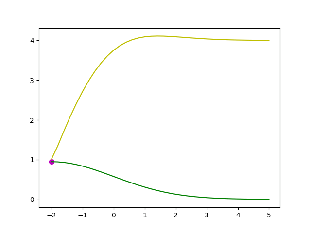

# Hyper-Prameter Optimization Library using GP-UCB (gphypo)

<!---
[](https://travis-ci.org/LittleWat/gp_ycb_python_lib)
-->

## Install
```
python setup.py install
```


## Usage

1. Copy the sample directory (ex. samples/svm). 

2. Edit 4 ~ 6 files in your copied directory. ("HOGE" should be set to your model name.)

    1. param_dir/generate_HOGE_param_file.py (You don't necessarily use this script.)
    
        This file generate hyper-paramtere sets. 
        
    2. cmdline_HOGE.txt
    
        This file is a cmd-line script that calls your machine learning programs that contains hyper-parameter.
        
        If you need a config file that contains hyper-paramter to call your program, the config file sould be set "$param_file"
        
    3. parameter_HOGE.json (Optional, but maybe useful to use in "get_result" function of "myenv.py")
    
        This file is used to kick your program. Also, you should set a paramter in order to get the result of your program (ex. "filename_result": "./libsvm/output/accuracy_$model_number.txt").
        
        "$model_number" is optional. If you would like to save your model every bandit process, you should use this.
        
    4. parameter_gp.json
    
        This file is used to set paramers of Gaussian Process.
        
    5. myenv.py
    
        You have to implement "get_result" function.

        ```python
        from gphypo.env import Cmdline_Environment
        
        
        class MyEnvironment(Cmdline_Environment):
            def get_result(self):
                
                ### WRITE BELOW ###
                
                
                res = GET_YOUR_PROGRAMS_OUTPUT
                ################
                
                return res
        ```

     6. run.sh (Optional)
        You have to call "run.py" here.
        

## Demo
GP kernel was set below

```python
from sklearn.gaussian_process.kernels import RBF, WhiteKernel, ConstantKernel as C

C(1, constant_value_bounds="fixed") * RBF(2, length_scale_bounds="fixed") + WhiteKernel(1e-1)
```

- Yellow mesh means the UCB score.
- Green mesh means the mean score.
- Blue mesh means the ground-truth (gt) score.

 
### gaussian optimization


### libsvm optimization
Train and test dataset is the same iris dataset. (not good)



### lda optimization


